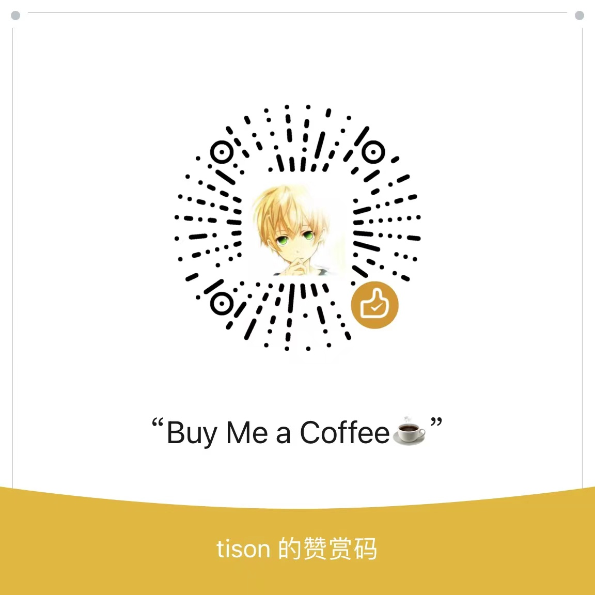

 This work is licensed under a <a rel="license" href="http://creativecommons.org/licenses/by-nc-sa/4.0/">Creative Commons Attribution-NonCommercial-ShareAlike 4.0 International License</a>.

## 精选文章

* [上游优先的故事](https://town.korandoru.io/blog/upstream-first-stories)
* [高效参与开源的诀窍](https://www.tisonkun.org/2021/12/05/effective-open-source-participant/)
* [共同创造价值](https://www.tisonkun.org/2022/02/10/value-creation/)
* [开源共同体的治理模型](https://www.tisonkun.org/2022/01/06/open-source-governance/)
* [开发者关系简明指南](https://www.tisonkun.org/2022/08/05/what-is-devrel/)
* [开发者体验的基础设施](https://www.tisonkun.org/2022/10/28/developer-experience-infrastructure/)
* [《大教堂与集市》书评](https://www.tisonkun.org/2021/12/14/the-cathedral-and-the-bazaar/)
* [《纳瓦尔宝典》书评](https://www.tisonkun.org/2022/06/09/the-almanack-of-naval-ravikant/)

## 欢迎订阅同名知识星球

## ...或直接支持我的创作

